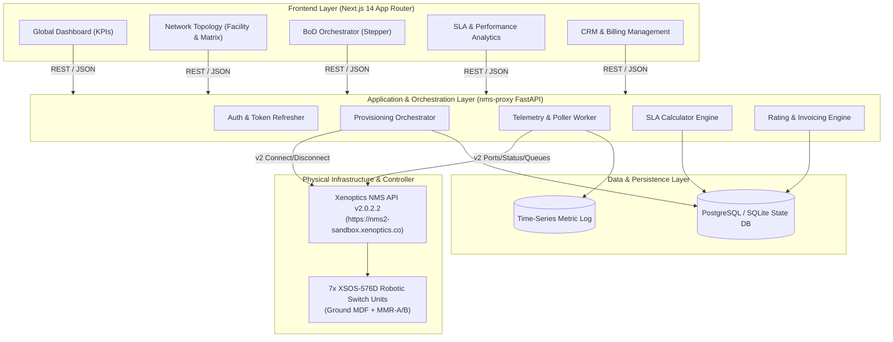
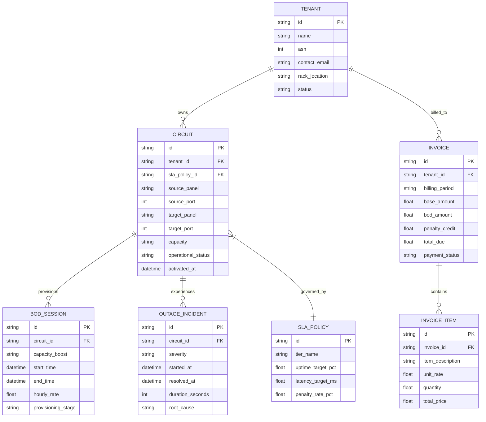
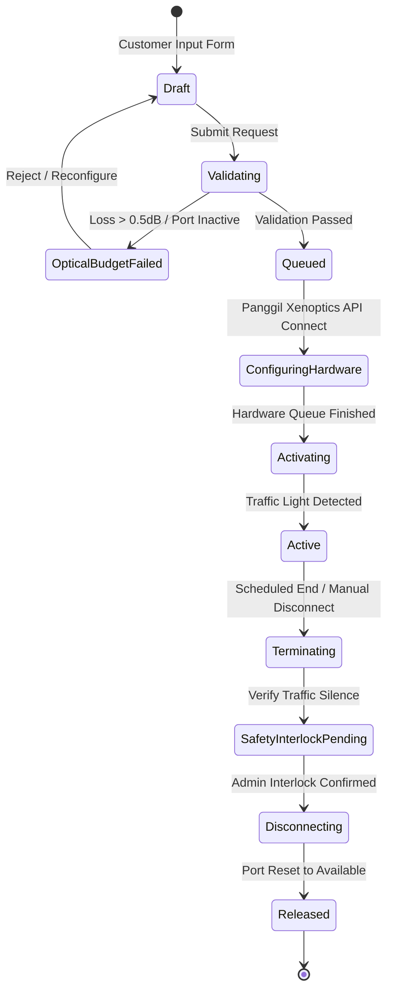

# Software Development Lifecycle (SDLC) Specification
## Xenoptics IXP Orchestration & BSS/OSS Platform
**Dokumen Spesifikasi Kebutuhan, Desain Arsitektur, dan Roadmap Pengembangan Sistem**

---

## 1. Fase Inisiasi & Analisis Kebutuhan (Requirements Engineering)

### 1.1 Latar Belakang & Pernyataan Masalah (*Problem Statement*)
Pengelolaan sakelar optik robotik (*robotic optical matrix switch*) Xenoptics XSOS-576D saat ini berada pada tingkatan manajemen elemen jaringan murni (L1 Element Management System) melalui Xenoptics NMS API v2.0.2.2.
Untuk kebutuhan penyedia layanan *Internet Exchange Point* (IXP) atau *Data Center Interconnect* (DCI), pengoperasian perangkat fisik ini harus ditransformasikan ke dalam ekosistem layanan mandiri (*Bandwidth-on-Demand*) yang terhubung langsung dengan:
1. Pemenuhan pesanan cross-connect jarak jauh (*Remote Provisioning*).
2. Pemantauan status sirkuit aktif secara *real-time* (*Connection Monitoring*).
3. Evaluasi kepatuhan target performa layanan (*SLA & Availability*).
4. Pemetaan visual jalur fisik gedung dan matriks sakelar (*Multi-Tier Topology*).
5. Manajemen pelanggan, kontrak komersial, hingga faktur tagihan (*CRM & Metered Billing*).

---

### 1.2 Persona Pengguna (*User Personas*)

| Persona | Peran | Kebutuhan Utama |
| :--- | :--- | :--- |
| **NOC Operator / NetOps** | Pengawas Jaringan 24/7 | Monitoring koneksi real-time, deteksi dini alarm Optical LOS, *root-cause analysis* insiden. |
| **Provisioning Engineer** | Eksekutor Teknis | Eksekusi *cross-connect* / *disconnect* remote dengan proteksi *safety interlock*, cek budget redaman optik. |
| **IXP Member / Tenant** | Pelanggan Eksternal | Portal mandiri untuk permintaan kapasitas *Bandwidth-on-Demand* (BoD 10G/100G/400G), pantau SLA uptime. |
| **Billing & Finance Admin** | Pengelola Keuangan | Kalkulasi biaya bulanan otomatis, rating pemakaian BoD temporer, pemotongan kompensasi penalti SLA. |

---

### 1.3 Kebutuhan Fungsional (5 Pilar Siklus Hidup)

#### FR-1: Remote Provisioning & Bandwidth on Demand (BoD)
* **FR-1.1**: Sistem harus menyediakan formulir permintaan cross-connect baru dengan parameter: Sumber (Panel & Port), Tujuan (Panel & Port), Kapasitas (10G/100G/400G), Durasi (Permanen/Berjadwal), dan SLA Tier.
* **FR-1.2**: Sistem wajib menjalankan *Optical Feasibility Check* (estimasi *insertion loss* $\le 0.5\text{ dB}$, tipe fiber kompatibel Duplex/Simplex) sebelum memicu hardware.
* **FR-1.3**: Sistem mengotomasi eksekusi tugas ke Xenoptics NMS via `POST /api/v2/connectivity/connect` dan memantau antrean `GET /api/v2/connectivity/queues`.
* **FR-1.4**: Sistem harus menerapkan *Safety Interlock* dua tahap pada proses `POST /api/v2/connectivity/disconnect` guna mencegah pemutusan sirkuit aktif secara tidak sengaja.

#### FR-2: Monitoring Koneksi Aktif (*Connection & Port Telemetry*)
* **FR-2.1**: Sistem harus memetakan status matriks 1.152 port (742 Connected, 386 Available, 24 Disabled) secara berkala dari `/api/v2/ports/summary`.
* **FR-2.2**: Sistem mencatat riwayat sirkuit aktif beserta waktu mulai (*timestamp started*), pelaksana (*created_by*), dan status operasional.
* **FR-2.3**: Sistem mendeteksi fluktuasi redaman atau *Optical LOS* dan mengelompokkannya ke tingkat keparahan (*Critical*, *Warning*, *Info*).

#### FR-3: Availability & SLA Compliance Engine
* **FR-3.1**: Sistem menghitung uptime bergulir 30 hari (*rolling 30-day availability*) per sirkuit pelanggan:
  $$\text{Availability (\%)} = \left( 1 - \frac{\sum \text{Downtime (menit)}}{\text{Total Waktu Periode (menit)}} \right) \times 100\%$$
* **FR-3.2**: Pengelompokan target SLA:
  * *Platinum (FSI/Bank)*: Target Uptime 99.999%, Max Latency $< 1\text{ ms}$.
  * *Gold (Hyperscaler/CDN)*: Target Uptime 99.99%, Max Latency $< 2\text{ ms}$.
  * *Silver (Enterprise)*: Target Uptime 99.95%, Max Latency $< 5\text{ ms}$.
* **FR-3.3**: Sistem secara otomatis menghitung *SLA Penalty Credit* jika uptime riil jatuh di bawah target komitmen.

#### FR-4: Multi-Layer Topology & Path Tracing
* **FR-4.1**: Visualisasi Fasilitas Gedung (*Facility Level*): Menampilkan alur jalur kabel dari Ground Floor (MDF-1/2/3) melalui riser vertikal menuju Meet-Me-Room (MMR-A & MMR-B Lantai 2 & Lantai 5).
* **FR-4.2**: Visualisasi Robotic Matrix: Representasi visual port East/West SMU pada 7 unit XSOS-576D beserta status slot optik.
* **FR-4.3**: Fitur *Path Trace*: Kemampuan menyorot jalur kabel dari rak pelanggan asal, melewati patch panel gedung, modul robotik XSOS, hingga switch fabric IXP.

#### FR-5: CRM & Billing Engine
* **FR-5.1**: Direktori Pelanggan: Manajemen data tenant (Nama Organisasi, Nomor ASN, PIC Operasional & Keuangan, Alokasi Rak).
* **FR-5.2**: Katalog Tarif (*Rate Plan*):
  * *Fixed Recurring Port Charge*: Biaya bulanan dasar per port aktif.
  * *BoD Hourly Metered Charge*: Biaya pemakaian kapasitas temporer dihitung per jam/hari.
  * *One-time Setup Fee*: Biaya pemasangan kabel fisik awal.
* **FR-5.3**: Generator Faktur Otomatis (*Invoice Engine*):
  $$\text{Total Invoice} = \text{Base Port Fee} + \sum(\text{BoD Usage Hours} \times \text{Hourly Rate}) + \text{Setup Fee} - \text{SLA Penalty Credit}$$

---

## 2. Fase Perancangan Sistem & Arsitektur (System Design)

### 2.1 Arsitektur Tingkat Tinggi (*High-Level Architecture*)

---

### 2.2 Desain Skema Database Relasional (Entity Relationship)

---

### 2.3 State Machine: Siklus Hidup Provisioning BoD

---

## 3. Matriks Integrasi API (Xenoptics API Mapping)

| Alur Siklus | Endpoint NMS API | Metode | Payload Utama | Tanggung Jawab Sistem Orkestrator |
| :--- | :--- | :--- | :--- | :--- |
| **Autentikasi** | `/api/v2/authentication/login` | `POST` | `username`, `password` | Mengelola *Access Token* JWT & *Refresh Token* otomatis setiap 50 menit. |
| **Koneksi Baru** | `/api/v2/connectivity/connect` | `POST` | `source_panel_name`, `source_port_no`, `target_panel_name`, `target_port_no`, `route` | Memetakan pesanan Tenant ID ke port fisik, mengonversi pesanan ke ID koneksi. |
| **Antrean Tugas** | `/api/v2/connectivity/queues` | `GET` | *None* | Memantau transisi tugas robotik (`Waiting` $\rightarrow$ `Operating`). |
| **Sirkuit Aktif** | `/api/v2/connectivity/connections`| `GET` | *None* | Sinkronisasi koneksi yang sukses terpasang ke database lokal. |
| **Pemutusan Jalur**| `/api/v2/connectivity/disconnect`| `POST` | `panel_name`, `port_no` | Validasi *safety interlock* 2 langkah sebelum memicu pelepasan port. |
| **Status Port** | `/api/v2/ports/summary` | `GET` | *None* | Menghitung agregat kapasitas terpakai vs tersedia (1.152 port). |
| **Inventori Unit** | `/api/v2/inventory` | `GET` | *None* | Memeriksa ketersediaan dan uptime 7 unit XSOS-576D di lokasi fisik. |

---

## 4. Rencana Implementasi & Pelaksanaan (SDLC Phases & Sprints)

### Sprint 1: Frontend Modular & Interactivity (Minggu 1)
* Mengintegrasikan 5 navigasi tab utama ke dalam Next.js (`nms-dashboard`):
  1. `Global Dashboard` (KPI, throughput chart, alarm donut).
  2. `Network Topology` (SVG gedung MDF/MMR + Grid Matriks XSOS-576D).
  3. `BoD Orchestrator` (Form kalkulasi budget redaman & Stepper 4 tahap).
  4. `Performance & SLA Analytics` (Target vs Actual per persona, tabel tiket gangguan).
  5. `CRM & Billing` (Daftar tenant, kalkulator tagihan, preview invoice).
* Memastikan semua komponen terhubung dengan *TypeScript types* terpadu.

### Sprint 2: Data Persistence & Business Layer (Minggu 2)
* Pembuatan skema database relasional (PostgreSQL/SQLite) untuk tabel `Tenant`, `Circuit`, `SLA`, dan `Billing`.
* Penambahan endpoint REST API di `nms-proxy` (FastAPI) untuk melayani operasi CRUD data bisnis.

### Sprint 3: Automation, Telemetry Poller & SLA Calculator (Minggu 3)
* Pemasangan background worker (*APScheduler / Celery*) untuk:
  * Polling metrik port & alarm setiap 10–30 detik.
  * Menghitung total durasi downtime per sirkuit secara otomatis.
  * Menghitung uptime rate bulanan per pelanggan dan mencatat potensi pelanggaran SLA.

### Sprint 4: Billing Rating Engine & Safety Hardening (Minggu 4)
* Mengaktifkan kalkulasi faktur bulanan otomatis:
  * Mengakumulasikan sewa port tetap + jam pemakaian BoD temporer.
  * Memotong kredit restitusi SLA pada tagihan pelanggan jika terjadi insiden.
* Pengujian menyeluruh (*End-to-End Safety Testing*): memastikan tidak ada pemutusan kabel aktif tanpa konfirmasi interlock ganda.

---

## 5. Rencana Pengujian & Jaminan Mutu (Quality Assurance)

1. **Uji Fungsionalitas API (Contract Testing)**: Menguji konsistensi respons JSON `nms-proxy` terhadap simulator sandbox Xenoptics.
2. **Uji Keamanan & Interlock Jaringan (Safety Interlock Test)**: Menguji skenario saat operator mencoba melakukan *Disconnect* pada port bertrafik tinggi; sistem wajib menahan perintah sampai verifikasi 2 langkah terpenuhi.
3. **Uji Simulasi Akurasi Billing**: Memvalidasi kalkulasi tagihan dengan memasukkan simulasi *outage* 45 menit pada sirkuit SLA Platinum; memastikan nilai kompensasi penalti tepat memotong total tagihan.
