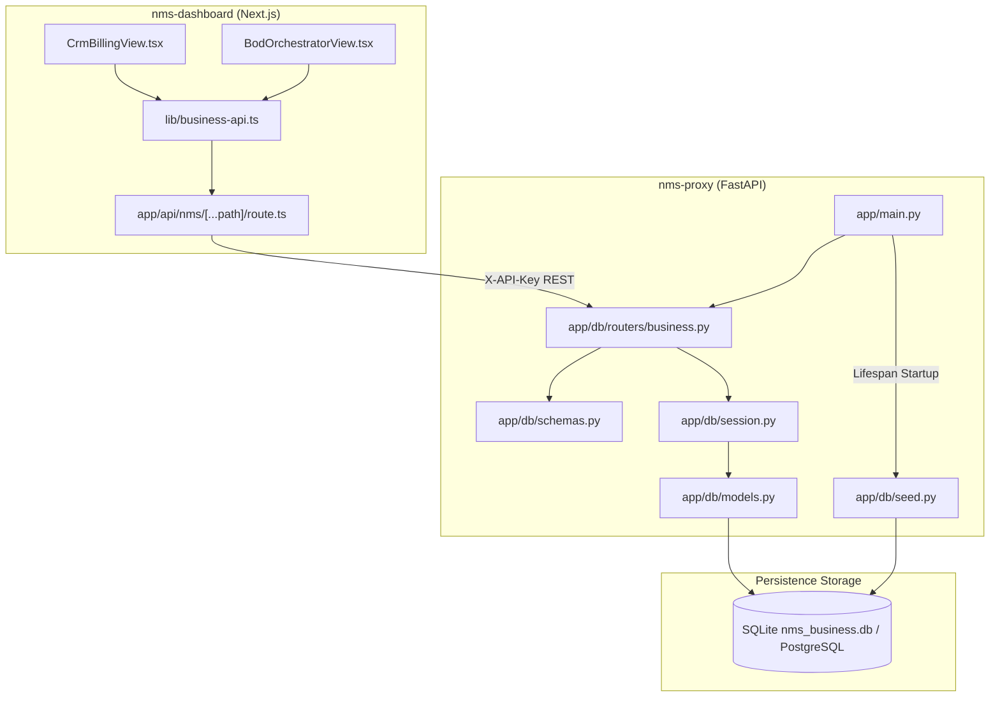

# Sprint 2: Data Persistence & Business Layer Implementation Plan

> **For agentic workers:** REQUIRED SUB-SKILL: Use superpowers:subagent-driven-development to implement this plan task-by-task. Steps use checkbox (`- [ ]`) syntax for tracking.

**Goal:** Membangun lapisan persistensi basis data relasional (SQLAlchemy 2.0 SQLite & PostgreSQL) dan endpoint REST API `/business/*` pada `nms-proxy`, serta mengintegrasikannya secara *live* dengan UI `nms-dashboard` (CRM, BoD, dan Invoice Generator).

**Architecture:** Mengadopsi Clean Architecture modular pada `nms-proxy`: `app/db/session.py` mengelola koneksi database fleksibel (SQLite default, PostgreSQL via `DATABASE_URL`), `app/db/models.py` mendefinisikan tabel relasional, `app/db/seed.py` mengisi data baseline, dan `app/db/routers/business.py` menyediakan endpoint REST. Di frontend, Next.js API proxy meneruskan rute `/business/*` dan komponen UI bermutasi secara persisten.

**Architecture Diagram:**

**Tech Stack:** Python 3.11, FastAPI 0.115, SQLAlchemy 2.0, Pydantic v2, Next.js 14, TypeScript, React 18.  
**Spec:** [docs/superpowers/specs/2026-10-06-sprint-2-data-persistence-design.md](file:///e:/Project/Nms/docs/superpowers/specs/2026-10-06-sprint-2-data-persistence-design.md)

## Global Constraints
- `database_url` default adalah `sqlite:///./nms_business.db` dengan opsi PostgreSQL tanpa modifikasi kode aplikasi.
- Seluruh endpoint `/business/*` wajib diproteksi validasi `X-API-Key`.
- Tipe data domain di frontend harus konsisten dengan kontrak TypeScript di `nms-dashboard/types/lifecycle.ts`.
- Kode seeder harus *idempotent* (tidak membuat duplikasi data jika tabel sudah berisi record).

---

### Task 1: Database Setup, Models, & Auto-Seeder di `nms-proxy`

**Files:**
- Modify: `nms-proxy/app/config.py`
- Modify: `nms-proxy/requirements.txt`
- Create: `nms-proxy/app/db/__init__.py`
- Create: `nms-proxy/app/db/session.py`
- Create: `nms-proxy/app/db/models.py`
- Create: `nms-proxy/app/db/seed.py`
- Create: `nms-proxy/tests/test_db_models.py`

**Interfaces:**
- Produces: `get_db()`, `init_db_and_seed()`, ORM models (`Tenant`, `SlaPolicy`, `Circuit`, `BodSession`, `Invoice`)

- [ ] **Step 1: Update requirements & config dengan database_url**
  Tambahkan `database_url: str = "sqlite:///./nms_business.db"` di `nms-proxy/app/config.py` dan `sqlalchemy>=2.0.30` di `nms-proxy/requirements.txt`.

- [ ] **Step 2: Buat `app/db/session.py`**
  Implementasikan engine creation dengan `connect_args={"check_same_thread": False}` untuk SQLite, `sessionmaker`, declarative `Base`, dan FastAPI dependency `get_db()`.

- [ ] **Step 3: Buat `app/db/models.py`**
  Implementasikan tabel ORM sesuai rancangan:
  - `Tenant`: `id`, `name`, `asn`, `customer_type`, `contact_email`, `rack_location`, `contract_tier`, `monthly_base_commit`, `status`, `created_at`
  - `SlaPolicy`: `id`, `tier_name`, `uptime_target_pct`, `latency_target_ms`, `penalty_rate_pct`
  - `Circuit`: `id`, `tenant_id`, `sla_policy_id`, `source_panel`, `source_port`, `target_panel`, `target_port`, `capacity`, `operational_status`, `activated_at`
  - `BodSession`: `id`, `tenant_id`, `circuit_id`, `route`, `source_panel`, `source_port`, `target_panel`, `target_port`, `capacity`, `sla_tier`, `duration`, `stage`, `insertion_loss_db`, `return_loss_db`, `est_switching_time_sec`, `monthly_cost`, `auto_approved`, `created_at`
  - `Invoice`: `id`, `tenant_id`, `billing_period`, `base_port_fee`, `bod_burst_usage_hours`, `bod_burst_rate_per_hour`, `bod_burst_total`, `sla_outage_downtime_min`, `sla_penalty_credit`, `subtotal`, `tax_amount`, `total_due`, `status`, `due_date`, `created_at`

- [ ] **Step 4: Buat `app/db/seed.py`**
  Mengisi data inisial baseline untuk 6 Tenant (`TNT-001` hingga `TNT-006`), 3 SLA Policy (`Platinum`, `Gold`, `Silver`), sirkuit aktif contoh, dan sampel invoice. Eksekusi ini bersifat *idempotent* (cek apakah count tenant > 0).

- [ ] **Step 5: Buat dan jalankan test `test_db_models.py`**
  Verifikasi inisialisasi tabel dan keberhasilan seed data.

---

### Task 2: Pydantic Schemas & REST API Endpoints di `nms-proxy`

**Files:**
- Create: `nms-proxy/app/db/schemas.py`
- Create: `nms-proxy/app/db/routers/__init__.py`
- Create: `nms-proxy/app/db/routers/business.py`
- Modify: `nms-proxy/app/main.py`
- Create: `nms-proxy/tests/test_business_api.py`

**Interfaces:**
- Produces: `/business/overview`, `/business/tenants`, `/business/circuits`, `/business/sla/policies`, `/business/bod/requests`, `/business/invoices`

- [ ] **Step 1: Buat `app/db/schemas.py`**
  Definisikan Pydantic v2 schemas:
  - `TenantResponse`, `TenantCreate`
  - `CircuitResponse`, `CircuitCreate`
  - `SlaPolicyResponse`
  - `BodRequestResponse`, `BodRequestCreate`, `BodRequestUpdateStage`
  - `InvoiceResponse`, `InvoiceCreate`, `InvoiceStatusUpdate`
  - `BusinessOverviewResponse`

- [ ] **Step 2: Buat `app/db/routers/business.py`**
  Implementasikan seluruh handler endpoint dengan otentikasi `require_api_key` dan dependency `get_db`.

- [ ] **Step 3: Hubungkan router ke `app/main.py` & inisialisasi DB di lifespan**
  Panggil `init_db_and_seed()` di lifespan `main.py` dan daftarkan `app.include_router(business_router, prefix="/business", tags=["Business Layer"])`.

- [ ] **Step 4: Buat dan jalankan test `test_business_api.py`**
  Verifikasi endpoint `/business/tenants`, `/business/overview`, dan `POST /business/invoices`.

---

### Task 3: Extension API Route Handler & Client Helper di `nms-dashboard`

**Files:**
- Modify: `nms-dashboard/lib/nms-api.ts`
- Modify: `nms-dashboard/app/api/nms/[...path]/route.ts`
- Create: `nms-dashboard/lib/business-api.ts`

**Interfaces:**
- Produces: `nmsProxyPatch()`, `GET /api/nms/business/...`, `POST /api/nms/business/...`, `PATCH /api/nms/business/...`, `fetchTenants()`, `fetchInvoices()`, `createInvoice()`, `fetchBodRequests()`, `createBodRequest()`

- [ ] **Step 1: Tambahkan `nmsProxyPatch` di `nms-dashboard/lib/nms-api.ts`**
  Dukung metode HTTP PATCH untuk memperbarui stage BoD atau status pembayaran invoice.

- [ ] **Step 2: Update `nms-dashboard/app/api/nms/[...path]/route.ts`**
  Dukung segmen `business` di `resolveTargetPath` dan tambahkan handler `export async function PATCH(...)`.

- [ ] **Step 3: Buat `nms-dashboard/lib/business-api.ts`**
  Menyediakan wrapper ramah browser:
  - `fetchTenants(): Promise<TenantCustomer[]>`
  - `fetchInvoices(): Promise<InvoiceStatement[]>`
  - `createInvoice(data: CreateInvoiceDto): Promise<InvoiceStatement>`
  - `updateInvoiceStatus(invoiceId: string, status: string): Promise<InvoiceStatement>`
  - `fetchBodRequests(): Promise<BodRequestItem[]>`
  - `createBodRequest(data: CreateBodDto): Promise<BodRequestItem>`

---

### Task 4: UI Integration di `nms-dashboard` (`CrmBillingView` & `BodOrchestratorView`)

**Files:**
- Modify: `nms-dashboard/app/components/nms-dashboard/CrmBillingView.tsx`
- Modify: `nms-dashboard/app/components/nms-dashboard/BodOrchestratorView.tsx`

- [ ] **Step 1: Integrasikan `CrmBillingView.tsx` ke backend persisten**
  Ganti inisialisasi state statis dengan `useEffect` pemanggilan `fetchTenants()` dan `fetchInvoices()`.
  Perbarui fungsi `handleGenerateInvoice` agar memanggil `createInvoice()` via API sehingga invoice baru tersimpan di database SQLite dan langsung muncul di daftar faktur.

- [ ] **Step 2: Integrasikan `BodOrchestratorView.tsx` ke backend persisten**
  Ganti antrean BoD statis dengan `fetchBodRequests()` dan sambungkan tombol formulir submit BoD ke `createBodRequest()`.

- [ ] **Step 3: Verifikasi Visual & Validasi E2E**
  Jalankan pengujian end-to-end melalui browser testing atau cURL untuk memastikan data tersimpan secara persisten dan reload halaman tidak menghilangkan invoice baru.
