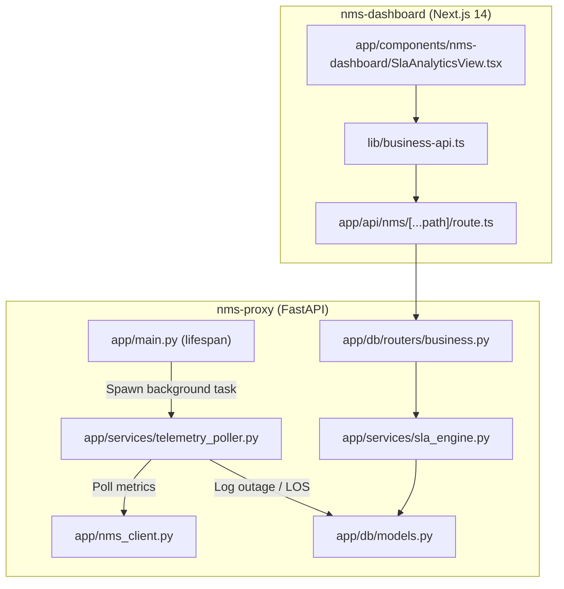

# Sprint 3: Automation, Telemetry Poller & SLA Calculator Implementation Plan

> **For agentic workers:** REQUIRED SUB-SKILL: Use superpowers:subagent-driven-development to implement this plan task-by-task. Steps use checkbox (`- [ ]`) syntax for tracking.

**Goal:** Membangun background telemetry poller worker, mesin kalkulasi kepatuhan SLA rolling 30-hari dan penalti kredit, endpoint REST API telemetri di `nms-proxy`, serta mengintegrasikannya dengan UI `SlaAnalyticsView` dan simulator insiden interaktif di `nms-dashboard`.

**Architecture:** Background poller (`app/services/telemetry_poller.py`) berjalan sebagai `asyncio.Task` di dalam `lifespan` FastAPI `nms-proxy`, mengagregasikan status port dan sirkuit setiap interval 15 detik. `app/services/sla_engine.py` menghitung ketersediaan (Availability %) dari akumulasi downtime di tabel `outage_incidents`, mengevaluasi status kepatuhan (Good, Watch, Breach), dan menghitung kompensasi penalti. Frontend `SlaAnalyticsView.tsx` menyajikan data telemetri aktual dan menyediakan fitur simulasi gangguan (*Outage Simulator*).

**Architecture Diagram:**

**Tech Stack:** Python 3.11, FastAPI, Asyncio, SQLAlchemy 2.0, Next.js 14, React 18, TypeScript.  
**Spec:** [docs/superpowers/specs/2026-10-07-sprint-3-telemetry-sla-design.md](file:///e:/Project/Nms/docs/superpowers/specs/2026-10-07-sprint-3-telemetry-sla-design.md)

## Global Constraints
- Poller worker harus berjalan non-blocking dan berhenti secara bersih (*graceful shutdown*) saat server dihentikan.
- Formula SLA harus menggunakan basis 30-hari (43.200 menit).
- Seluruh endpoint API baru wajib dilindungi header `X-API-Key`.
- Tipe data TypeScript di frontend harus kompatibel dengan `types/lifecycle.ts`.

---

### Task 1: SLA Engine & Calculation Logic di `nms-proxy`

**Files:**
- Create: `nms-proxy/app/services/__init__.py`
- Create: `nms-proxy/app/services/sla_engine.py`
- Create: `nms-proxy/tests/test_sla_engine.py`

**Interfaces:**
- Produces: `calculate_availability(downtime_minutes: float) -> float`, `evaluate_tier_compliance(actual_uptime: float, actual_latency: float, tier_name: str) -> str`, `calculate_sla_penalty(downtime_minutes: float, tier_name: str) -> float`, `get_sla_compliance_summary(db: Session)`

- [ ] **Step 1: Buat `app/services/__init__.py`**
- [ ] **Step 2: Buat `app/services/sla_engine.py`**
  Implementasikan fungsi-fungsi inti kalkulasi SLA:
  - Formula availability 30 hari: `max(0.0, round((1.0 - (downtime_minutes / 43200.0)) * 100.0, 4))`
  - Evaluasi target tier (Platinum 99.999%, Gold 99.99%, Silver 99.95%)
  - Hitung penalti kredit ($35/menit untuk Platinum, $25/menit untuk Gold, $15/menit untuk Silver)
  - Hitung rekapitulasi data kepatuhan tenant dari database
- [ ] **Step 3: Buat dan jalankan test `test_sla_engine.py`**
  Verifikasi perhitungan availability, evaluasi status (Good, Watch, Breach), dan kalkulasi kredit penalti.

---

### Task 2: Background Telemetry Poller Worker di `nms-proxy`

**Files:**
- Create: `nms-proxy/app/services/telemetry_poller.py`
- Modify: `nms-proxy/app/main.py`
- Create: `nms-proxy/tests/test_telemetry_poller.py`

**Interfaces:**
- Produces: `TelemetryPollerWorker`, `start_telemetry_poller()`, `stop_telemetry_poller()`, `get_telemetry_status()`

- [ ] **Step 1: Buat `app/services/telemetry_poller.py`**
  Implementasikan class `TelemetryPollerWorker` dengan loop `asyncio.sleep(interval)`:
  - Mengambil `/ports/summary` dan `/connectivity/connections` dari NMS Client.
  - Memperbarui status detak jantung (`last_poll_time`, `poll_count`, `is_running`).
- [ ] **Step 2: Sambungkan poller worker ke `lifespan` di `app/main.py`**
  Start background task saat lifespan masuk, batalkan task saat lifespan keluar.
- [ ] **Step 3: Buat dan jalankan test `test_telemetry_poller.py`**
  Verifikasi poller lifecycle start/stop dan pengambilan status.

---

### Task 3: REST API Endpoints Telemetri & SLA di `nms-proxy`

**Files:**
- Modify: `nms-proxy/app/db/schemas.py`
- Modify: `nms-proxy/app/db/routers/business.py`
- Create: `nms-proxy/tests/test_sla_api.py`

**Interfaces:**
- Produces: `GET /business/sla/compliance`, `GET /business/sla/incidents`, `POST /business/sla/incidents`, `POST /business/sla/incidents/simulate`, `PATCH /business/sla/incidents/{id}/resolve`, `GET /business/telemetry/status`

- [ ] **Step 1: Tambahkan schemas di `app/db/schemas.py`**
  `SlaComplianceResponse`, `OutageIncidentResponse`, `OutageIncidentCreate`, `SimulateIncidentRequest`, `TelemetryStatusResponse`.
- [ ] **Step 2: Tambahkan endpoints di `app/db/routers/business.py`**
  Implementasikan rute handler SLA dan telemetri lengkap dengan validasi.
- [ ] **Step 3: Buat dan jalankan test `test_sla_api.py`**
  Uji GET compliance, POST incident simulate, dan status telemetri poller.

---

### Task 4: Frontend API Bridge di `nms-dashboard`

**Files:**
- Modify: `nms-dashboard/lib/business-api.ts`

**Interfaces:**
- Produces: `fetchSlaCompliance()`, `fetchIncidents()`, `simulateIncident()`, `resolveIncident()`, `fetchTelemetryStatus()`

- [ ] **Step 1: Tambahkan fungsi helper SLA di `nms-dashboard/lib/business-api.ts`**
  Ekspor fungsi untuk konsumsi data kepatuhan, histori tiket insiden, dan pemicu simulasi insiden.

---

### Task 5: Integrasi UI & Outage Simulator di `SlaAnalyticsView.tsx`

**Files:**
- Modify: `nms-dashboard/app/components/nms-dashboard/SlaAnalyticsView.tsx`

- [ ] **Step 1: Sambungkan tabel kepatuhan SLA ke endpoint live**
  Ganti data statis `INITIAL_SLA_COMPLIANCE` dengan data dinamis dari `fetchSlaCompliance()`.
- [ ] **Step 2: Sambungkan tabel tiket insiden ke database live**
  Tampilkan daftar insiden dari `fetchIncidents()`.
- [ ] **Step 3: Tambahkan tombol & modal "Simulate Outage Incident"**
  Memungkinkan operator menguji simulasi downtime (misal 45 menit) pada sirkuit tertentu dan melihat status SLA langsung berubah menjadi "Breach" dengan kalkulasi kredit penalti yang muncul secara otomatis.
- [ ] **Step 4: Verifikasi kompilasi frontend (`npm run build`) dan backend test suite**
