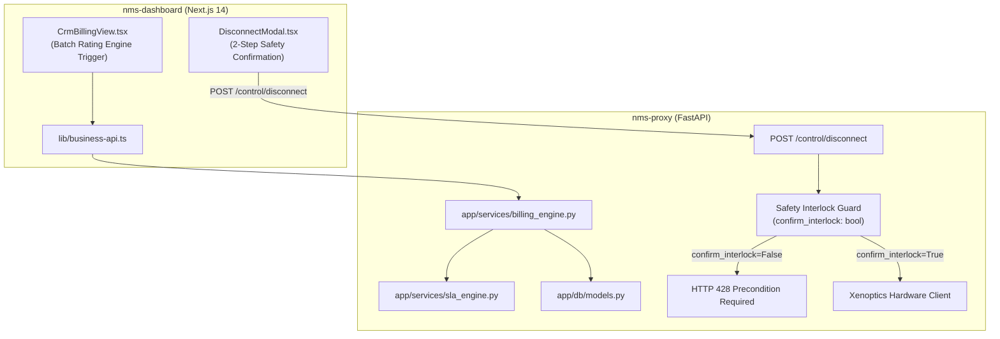

# Sprint 4: Billing Rating Engine & Safety Hardening Implementation Plan

> **For agentic workers:** REQUIRED SUB-SKILL: Use superpowers:subagent-driven-development to implement this plan task-by-task. Steps use checkbox (`- [ ]`) syntax for tracking.

**Goal:** Membangun Billing Rating Engine otomatis dengan pemotongan penalti SLA, memperkuat server-side Safety Interlock pada endpoint disconnect, mengintegrasikan antarmuka frontend, dan menjalankan pengujian mutu komprehensif.

**Architecture:** Modul `app/services/billing_engine.py` mengagregasikan biaya sewa port, sesi pemakaian BoD temporer, dan kalkulasi penalti SLA dari insiden untuk menerbitkan faktur komersial presisi. Di `app/main.py`, endpoint `POST /control/disconnect` diproteksi dengan interlock 2-tahap yang menolak pemutusan sirkuit aktif tanpa konfirmasi ganda (`confirm_interlock=True`) dengan status HTTP 428 Precondition Required. Frontend `CrmBillingView.tsx` dan `DisconnectModal.tsx` diselaraskan untuk eksekusi yang aman dan otomatis.

**Architecture Diagram:**

**Tech Stack:** Python 3.11, FastAPI, SQLAlchemy 2.0, Next.js 14, TypeScript.  
**Spec:** [docs/superpowers/specs/2026-10-07-sprint-4-billing-safety-design.md](file:///e:/Project/Nms/docs/superpowers/specs/2026-10-07-sprint-4-billing-safety-design.md)

## Global Constraints
- Pemutusan port tanpa `confirm_interlock=True` wajib ditolak dengan status kode HTTP 428.
- Perhitungan penalti restitusi SLA harus secara otomatis memotong subtotal faktur tagihan pelanggan.
- Pajak PPN 11% harus dihitung setelah pemotongan penalti kredit restitusi SLA.

---

### Task 1: Billing Rating Engine Service di `nms-proxy`

**Files:**
- Create: `nms-proxy/app/services/billing_engine.py`
- Create: `nms-proxy/tests/test_billing_engine.py`

**Interfaces:**
- Produces: `preview_tenant_invoice(tenant_id, billing_period, db)`, `generate_tenant_invoice(tenant_id, billing_period, db)`, `generate_all_monthly_invoices(billing_period, db)`

- [ ] **Step 1: Buat `app/services/billing_engine.py`**
  Implementasikan logika akumulasi sewa port + jam BoD - penalti SLA + PPN 11%.
- [ ] **Step 2: Buat dan jalankan test `test_billing_engine.py`**
  Verifikasi simulasi outage 45 menit pada tenant Platinum dan pastikan pemotongan kredit penalti tepat memotong total invoice.

---

### Task 2: Safety Interlock Hardening di `nms-proxy`

**Files:**
- Modify: `nms-proxy/app/main.py`
- Create: `nms-proxy/tests/test_safety_interlock.py`

**Interfaces:**
- Produces: Two-step confirmation enforcement on `POST /control/disconnect`

- [ ] **Step 1: Perbarui `DisconnectRequest` di `app/main.py`**
  Tambahkan `confirm_interlock: bool = False` dan logika pemeriksaan interlock yang mengembalikan status `428 Precondition Required` jika `confirm_interlock` adalah `False`.
- [ ] **Step 2: Buat dan jalankan test `test_safety_interlock.py`**
  Uji bahwa request tanpa interlock konfirmasi ditolak dengan 428, dan request dengan `confirm_interlock=True` lolos validasi.

---

### Task 3: REST API Endpoints di `nms-proxy` & Frontend Bridge

**Files:**
- Modify: `nms-proxy/app/db/routers/business.py`
- Modify: `nms-dashboard/lib/business-api.ts`

**Interfaces:**
- Produces: `POST /business/billing/generate-all`, `POST /business/billing/preview/{tenant_id}`, `generateAllInvoices()`, `previewTenantInvoice()`

- [ ] **Step 1: Tambahkan endpoint batch billing di `app/db/routers/business.py`**
- [ ] **Step 2: Tambahkan fungsi helper di `nms-dashboard/lib/business-api.ts`**

---

### Task 4: UI Integration di `nms-dashboard` (`CrmBillingView` & `DisconnectModal`)

**Files:**
- Modify: `nms-dashboard/app/components/nms-dashboard/CrmBillingView.tsx`
- Modify: `nms-dashboard/app/components/nms-dashboard/DisconnectModal.tsx`

- [ ] **Step 1: Tambahkan tombol Batch Auto-Rate di `CrmBillingView.tsx`**
  Tombol "⚡ Run Monthly Rating Batch" yang memicu `generateAllInvoices()` dan langsung merefresh daftar faktur.
- [ ] **Step 2: Perbarui `DisconnectModal.tsx`**
  Pastikan payload mengirimkan `confirm_interlock: true` saat tombol konfirmasi ditekan.

---

### Task 5: End-to-End Verification & QA Suite

- [ ] **Step 1: Jalankan seluruh test suite pytest di `nms-proxy`**
- [ ] **Step 2: Jalankan `npm run build` di `nms-dashboard`**
