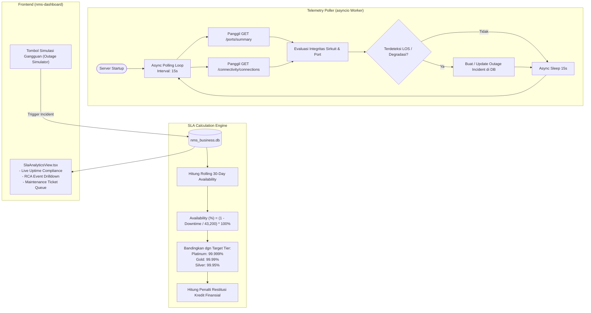

# Design Specification: Sprint 3 — Automation, Telemetry Poller & SLA Calculator
**Xenoptics IXP Orchestration & BSS/OSS Platform**
**Tanggal:** 2026-10-07  
**Status:** Approved by User  

---

## 1. Ringkasan Eksekutif (*Executive Summary*)
Pada Sprint 2, lapisan persistensi data relasional (SQLAlchemy 2.0) telah dibangun dengan entitas tenant, sirkuit, dan faktur.
Sprint 3 berfokus pada otomasi telemetri aktif dan kepatuhan kontrak layanan (SLA):
1. **Background Telemetry Poller**: Worker asynchronous berbasis `asyncio.Task` di `nms-proxy` yang berjalan terus-menerus pada siklus interval 15–30 detik untuk mengambil telemetri port dan sirkuit dari Xenoptics NMS API.
2. **Outage Detection & Incident Logging**: Mendeteksi jika terjadi Optical LOS atau status sirkuit degraded/disconnected, mencatat insiden ke tabel `outage_incidents`, dan melacak durasi downtime secara presisi.
3. **SLA Compliance Calculation Engine**: Menghitung ketersediaan bergulir 30-hari (*Rolling 30-Day Uptime Percentage*), membandingkannya terhadap target komitmen kontrak tier (Platinum 99.999%, Gold 99.99%, Silver 99.95%), dan menghitung kredit kompensasi penalti restitusi (*SLA Penalty Credit*).
4. **REST API Telemetri & SLA**: Menyediakan endpoint `/business/sla/compliance`, `/business/sla/incidents`, `/business/sla/incidents/simulate`, dan `/business/telemetry/status`.
5. **Integrasi Frontend `nms-dashboard`**: Menghubungkan tampilan `SlaAnalyticsView.tsx` dan `GlobalDashboardView.tsx` agar menyajikan metrik kepatuhan SLA aktual, daftar tiket gangguan NOC langsung dari database, serta kontrol interaktif untuk simulasi insiden.

---

## 2. Arsitektur & Alur Data (*System Architecture*)

---

## 3. Spesifikasi Logika Bisnis & Formula Matematis

### 3.1 Formula Ketersediaan Bergulir 30-Hari (*Rolling Availability*)
Periode waktu 30 hari memiliki total:
$$T_{\text{total}} = 30 \times 24 \times 60 = 43.200 \text{ menit}$$

Persentase ketersediaan (*Availability %*):
$$\text{Availability (\%)} = \left( 1 - \frac{\sum \text{Downtime (menit)}}{43.200} \right) \times 100\%$$

### 3.2 Klasifikasi Ambang Batas SLA Tier
| SLA Tier | Target Uptime | Maksimum Toleransi Downtime / 30 Hari | Target Latensi | Rate Penalti Kompensasi |
| :--- | :--- | :--- | :--- | :--- |
| **Platinum (FSI/Bank)** | 99.999% | $\le 0.432\text{ menit}$ ($\approx 26\text{ detik}$) | $< 1.0\text{ ms}$ | $35 / menit pelanggaran |
| **Gold (Hyperscaler/CDN)**| 99.99% | $\le 4.32\text{ menit}$ | $< 2.0\text{ ms}$ | $25 / menit pelanggaran |
| **Silver (Enterprise)** | 99.95% | $\le 21.6\text{ menit}$ | $< 5.0\text{ ms}$ | $15 / menit pelanggaran |

### 3.3 Status Kepatuhan (*Compliance Status*)
* `Good` / `Compliant`: $\text{Actual Uptime} \ge \text{Target Uptime}$ dan $\text{Actual Latency} \le \text{Target Latency}$.
* `Watch`: $\text{Actual Uptime} \ge \text{Target Uptime}$ namun latensi melonjak mendekati batas (gap $< 0.3\text{ ms}$), atau terjadi flapping singkat.
* `Breach`: $\text{Actual Uptime} < \text{Target Uptime}$ (melewati batas toleransi downtime).

---

## 4. Spesifikasi REST API Backend (`nms-proxy`)

| Method | Endpoint | Deskripsi |
| :--- | :--- | :--- |
| `GET` | `/business/telemetry/status` | Mengambil status telemetry poller (status aktif, total siklus tick, last poll timestamp). |
| `GET` | `/business/sla/compliance` | Mengambil agregat kalkulasi kepatuhan SLA rolling 30-hari untuk semua tier & tenant. |
| `GET` | `/business/sla/incidents` | Mengambil daftar tiket insiden gangguan (`outage_incidents`) terdaftar. |
| `POST`| `/business/sla/incidents` | Mencatat insiden baru (misal deteksi manual atau sistem). |
| `POST`| `/business/sla/incidents/simulate` | Memicu simulasi insiden pada sirkuit tertentu (dengan durasi downtime menit untuk pengujian kepatuhan SLA). |
| `PATCH`| `/business/sla/incidents/{id}/resolve`| Menandai insiden sebagai teratasi (*resolved*) dan mengunci durasi downtime. |

---

## 5. Rencana Pengujian & Validasi

1. **Unit Test SLA Calculator**:
   - Uji kalkulasi availability dengan 0 menit downtime $\rightarrow$ 100.0%.
   - Uji kalkulasi availability dengan 45 menit downtime pada Gold $\rightarrow$ status `Breach`, kalkulasi kredit penalti tepat.
2. **Integration Test Telemetry Poller & Endpoints**:
   - Uji startup worker dalam siklus lifespan FastAPI.
   - Uji endpoint `/business/sla/compliance` mengembalikan data valid.
   - Uji endpoint `/business/sla/incidents/simulate` dan verifikasi kalkulasi penalti langsung diperbarui di DB.
3. **Frontend Integration & E2E**:
   - `SlaAnalyticsView.tsx` terhubung live dengan data dari API.
   - Uji tombol simulasi di UI dan verifikasi perubahan status badge menjadi `Breach` / `Compliant`.
