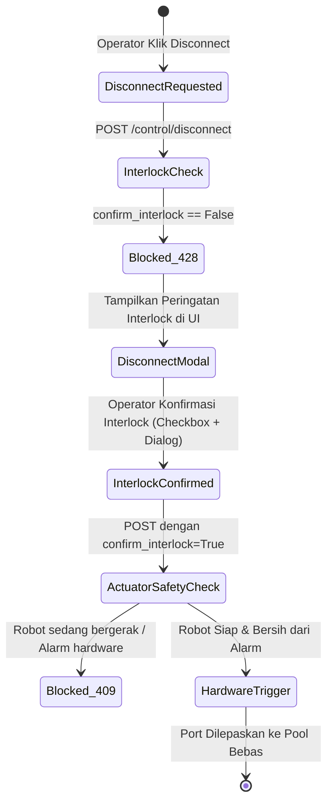

# Design Specification: Sprint 4 — Billing Rating Engine & Safety Hardening
**Xenoptics IXP Orchestration & BSS/OSS Platform**
**Tanggal:** 2026-10-07  
**Status:** Approved by User  

---

## 1. Ringkasan Eksekutif (*Executive Summary*)
Sprint 4 adalah fase penutup SDLC yang berfokus pada integrasi komersial menyeluruh (*Metered Billing Rating Engine*) dan proteksi keamanan tingkat tinggi (*Safety Hardening*):
1. **Billing Rating Engine**: Mengotomatisasi siklus penerbitan faktur bulanan tenant dengan mengakumulasikan biaya sewa port komitmen dasar, jam penggunaan kapasitas BoD dinamis, dan secara otomatis memotong kredit restitusi penalti SLA jika terjadi insiden gangguan pada periode penagihan.
2. **Server-Side Safety Interlock Guard**: Memperketat endpoint controlling pada `nms-proxy` (`POST /control/disconnect`) agar menolak setiap perintah pemutusan port yang tidak menyertakan verifikasi interlock 2-langkah (`confirm_interlock=True`) dengan status HTTP 428 Precondition Required.
3. **Frontend & QA Validation**: Memperbarui antarmuka pengguna `CrmBillingView.tsx` dan `DisconnectModal.tsx` agar selaras dengan proteksi backend, serta membangun test suite komprehensif untuk pengujian keamanan interlock dan simulasi akurasi perhitungan tagihan.

---

## 2. Arsitektur & Spesifikasi Logika Bisnis

### 2.1 Formula Rating Penagihan (*Billing Rating Formula*)
Untuk setiap tenant $T$ pada periode penagihan:
$$\text{Base Port Fee} = T_{\text{monthly\_base\_commit}}$$
$$\text{BoD Usage Amount} = \sum_{s \in \text{BoD Sessions}} (\text{Duration Hours}_s \times \text{Hourly Rate}_s)$$
$$\text{SLA Penalty Credit} = \sum_{c \in \text{Circuits}} \text{calculate\_sla\_penalty}(\text{Downtime Minutes}_c, T_{\text{contract\_tier}})$$
$$\text{Subtotal Net} = \max(0, \text{Base Port Fee} + \text{BoD Usage Amount} - \text{SLA Penalty Credit})$$
$$\text{Tax Amount (PPN 11\%)} = \text{round}(\text{Subtotal Net} \times 0.11, 2)$$
$$\text{Total Invoice Due} = \text{round}(\text{Subtotal Net} + \text{Tax Amount}, 2)$$

### 2.2 Arsitektur Safety Interlock Dua Tahap (*Two-Step Safety Interlock*)

---

## 3. Spesifikasi REST API Backend (`nms-proxy`)

| Method | Endpoint | Deskripsi |
| :--- | :--- | :--- |
| `POST` | `/business/billing/generate-all` | Batch job untuk menghasilkan faktur bulanan otomatis bagi seluruh tenant aktif dengan perhitungan rating presisi. |
| `POST` | `/business/billing/preview/{tenant_id}` | Menghitung simulasi faktur tenant secara instan tanpa menyimpannya ke database. |
| `POST` | `/control/disconnect` | Memutus koneksi port dengan validasi parameter `confirm_interlock: bool`. Menolak request dengan HTTP 428 jika `confirm_interlock` tidak terpenuhi. |

---

## 4. Rencana Pengujian Mutu (QA Test Suite)

1. **Uji Keamanan & Interlock Jaringan (`tests/test_safety_interlock.py`)**:
   - Upaya pemutusan koneksi tanpa `confirm_interlock` wajib ditolak dengan HTTP 428 dan pesan peringatan keselamatan.
   - Upaya pemutusan dengan `confirm_interlock=True` berhasil diteruskan ke controller hardware.
2. **Uji Akurasi Billing Rating (`tests/test_billing_rating.py`)**:
   - Simulasi 45 menit outage pada sirkuit Platinum (`TNT-003`, target 99.999%):
     - Toleransi: 0.432 menit $\rightarrow$ 44.568 menit pelanggaran $\times$ $35 = $1,559.88 potongan penalti kredit.
     - Memverifikasi total tagihan tepat memotong nilai kompensasi penalti dan pajak dihitung secara benar.
